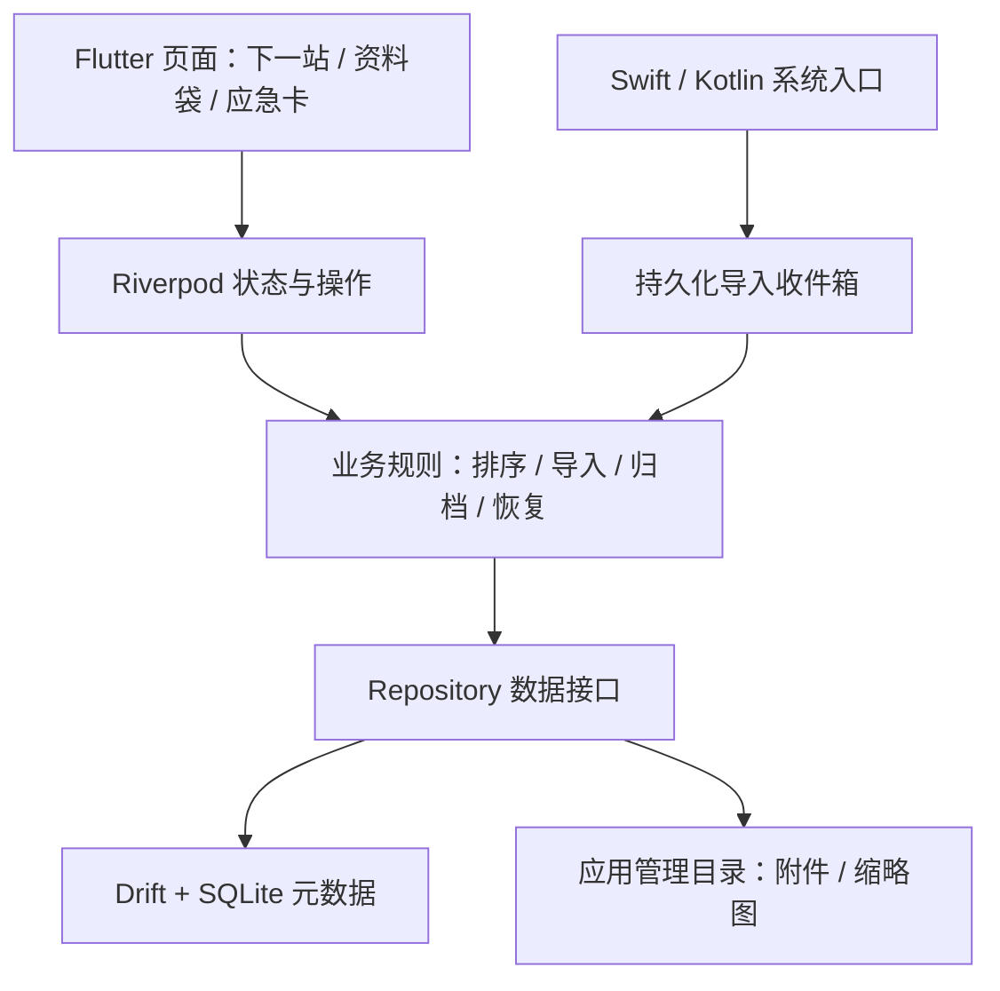

# 旅途胶囊：Android / iOS 跨端技术方案

调研日期：2026-09-22。状态：技术提案，尚未实现或完成双端验证。

## 1. 结论与前提

推荐 Flutter + Dart，共享界面、业务规则和本地数据层；以 Swift / Kotlin 实现平台入口。采用离线优先架构，第一版不依赖账号、服务端或在线 AI。

推荐基于当前已知条件：项目从零开始、目标是 Android 和 iOS 手机、尚无指定团队技术栈，核心价值是离线资料的可靠保存与快速展示。这里的适配成本判断是针对本项目的工程判断，不是市场份额排名或性能实测结论。

如果实际维护团队主要使用 React / TypeScript，优先级可以调整为 React Native + Expo Development Build；如果团队已有 Kotlin Multiplatform 经验，KMP + Compose 也合理。跨端框架都不能消除原生集成和双端测试。

## 2. 主流方案比较

| 方案 | 共享范围与机制 | 主要优势 | 对本项目的代价 | 建议 |
| --- | --- | --- | --- | --- |
| Flutter | Dart 业务与界面共享，自有渲染体系，插件或平台通道调用原生能力 | 统一卡片视觉、离线业务集中维护，适合从零建设 | 需要 Dart；分享扩展、文件权限与平台交互仍要适配 | 首选 |
| React Native + Expo | React / TypeScript 业务与界面共享，通过原生组件和模块集成系统 | React 团队上手方便，Expo 整合常用设备能力与构建流程 | 要管理原生库兼容；本项目必须用 Development Build，iOS 接收分享另做验证 | 强备选 |
| Kotlin Multiplatform + Compose Multiplatform | KMP 共享逻辑，可用 Compose 共享 UI，也可保留 SwiftUI / 原生 UI | Kotlin 团队复用优势明显，可灵活选择共享范围 | 双工具链及 iOS 互操作仍有成本；独立 SwiftUI 路线会增加界面工作 | 已有 Kotlin 团队时优先考虑 |
| Ionic + Capacitor | Web UI 配合原生容器及插件 | 已有 Web 产品容易复用，Web 团队熟悉 | 文件预览、原生分享等仍需插件/原生工程，交互要验证 WebView 表现 | 有现成 Web 产品时更合适 |
| .NET MAUI | C# / XAML，共享应用代码并面向多个原生平台 | 适合已有 .NET 团队 | 当前没有 C# 资产，缺少专门选择它的收益 | 本轮不选 |
| uni-app | Vue 等技术配合各端运行时，覆盖 App、Web 和小程序 | 有小程序需求或已有 Vue/uni-app 团队时有价值 | 不同渲染模式及原生插件适配需单独评估 | 本项目暂无小程序目标，不优先 |

事实核验：Flutter 支持共享代码并接入原生平台；React Native 新架构不应再按旧式异步桥模型评价；Compose Multiplatform 的 iOS 支持已于 2025 年进入 Stable，不能沿用“iOS 仍处于 Alpha”的判断。依据：[Flutter 架构](https://docs.flutter.dev/resources/architectural-overview)、[React Native 新架构](https://reactnative.dev/blog/2024/10/23/the-new-architecture-is-here)、[Compose iOS Stable](https://blog.jetbrains.com/kotlin/2025/05/compose-multiplatform-1-8-0-released-compose-multiplatform-for-ios-is-stable-and-production-ready/)。

其余方案的能力边界见 [Capacitor 官方文档](https://capacitorjs.com/docs)、[.NET MAUI 官方说明](https://learn.microsoft.com/en-us/dotnet/maui/what-is-maui?view=net-maui-10.0)、[uni-app 跨端原理](https://uniapp.dcloud.net.cn/tutorial/)。不承诺具体代码复用百分比、包体积或跑分，待实物验证。

## 3. 必须先解决的系统分享问题

“把资料分享出去”和“从其他 App 接收资料”是不同能力，不能用前者的插件证明后者可用。

截至本次调研，Expo 的 expo-sharing 已提供接收分享 API，但官方仍将该能力标记为 experimental，并提示其 iOS 扩展通过打开主应用处理分享的方式不受 Apple 官方支持，未来可能失效。因此不能直接把它当成本应用的可靠基础。这不意味着 React Native 无法实现，可改用独立原生分享扩展。依据：[Expo Sharing](https://docs.expo.dev/versions/latest/sdk/sharing/)。

建议 Flutter 与 React Native 路线都采用以下明确边界：

- Android：Kotlin 接收 ACTION_SEND / ACTION_SEND_MULTIPLE，处理临时 content URI 权限，将内容复制到应用管理目录；兼容冷启动和已运行状态。
- iOS：Swift Share Extension 在扩展内完成接收与保存，通过 App Group 存入收件箱；不依赖强行唤起主应用。扩展显示“已保存到收件箱”，主应用下次打开时完成归档。
- 扩展只做有限文件复制和基础校验，不加载整套 Flutter 引擎、不执行 OCR 或大文件解析。
- 每次导入有唯一任务 ID。主应用对收件箱进行幂等消费，避免重复分享回调生成重复条目。

依据：[Android 接收分享](https://developer.android.com/develop/ui/compose/sharing/receive)、[Apple Share Extension](https://developer.apple.com/library/archive/documentation/General/Conceptual/ExtensibilityPG/Share.html)、[Apple App Group 数据共享](https://developer.apple.com/documentation/technologyoverviews/shared-data)。

## 4. 首版产品范围

| 模块 | 首版交付 | 明确边界 |
| --- | --- | --- |
| 旅行管理 | 新建、编辑、归档旅行；目的地与时区 | 暂不做多人协作 |
| 资料袋 | 文字、地址、链接、图片、PDF；分类、搜索、编辑和删除 | 链接只保证 URL 和手动备注离线，不宣称网页正文已缓存 |
| 系统导入 | 双端文件选择器、图片选择器、系统接收分享、待整理收件箱 | 云端文件只有下载并复制成功后才显示“离线可用” |
| 下一站 | 行程时间、完成/取消、手动置顶、关联票据 | 不依赖定位、后台常驻或实时航班接口 |
| 大字地址卡 | 当地语言地址、备注、可复制、全屏展示 | 首版由用户填写，不自动翻译 |
| 应急卡 | 联系人、保险信息、常用求助语；打开系统拨号界面 | 不自动拨号，不宣称提供救援服务 |
| 数据保护 | 本地保存、删除旅行清理附件、版本化手动备份与恢复 | 无自动跨设备同步；卸载前需要备份 |

OCR、在线翻译、离线地图包、天气、机票动态、自动抓取邮件和 AI 行程规划进入后续阶段。地图入口可跳转系统地图，地图内容是否离线由地图应用决定。

## 5. 推荐架构与依赖

| 层 | 技术选择 | 说明 |
| --- | --- | --- |
| UI | Flutter / Dart stable | 共享设计体系，适配安全区域、返回手势、字体缩放和无障碍 |
| 状态 | Riverpod | 按业务功能管理异步状态与依赖，避免另加第二套全局状态工具 |
| 导航 | go_router | 管理页面与内部跳转；所有外部输入先校验再导航 |
| 本地数据 | Drift + SQLite | 关系查询、事务和版本迁移；二进制附件不放进数据库 |
| 文件能力 | 系统选择器 + 应用管理目录 | Dart 定义统一接口；插件通过 PoC 后锁定，缺口由原生实现 |
| PDF | iOS PDFKit / Android PdfRenderer 封装适配层 | 先验证分页、缩放、大文件和异常文档，之后评估是否采用现成插件 |
| 分享入口 | Swift 扩展 / Kotlin Intent | 与 Flutter 主应用通过持久化收件箱交接 |
| 密钥 | iOS Keychain / Android Keystore | 若启用内容加密，用于保护密钥；不保存大文件 |
| 测试 | flutter_test / integration_test + 平台测试 | 通用业务自动测试，原生分享需双端独立集成验证 |

项目按 trips、library、itinerary、emergency、inbox 五个功能模块组织；共享 database、files、platform 设施。界面不直接拼 SQL 或访问原生文件路径。参考 [Flutter 官方架构指南](https://docs.flutter.dev/app-architecture/guide)、[Drift](https://drift.simonbinder.eu/)、[Riverpod](https://pub.dev/packages/riverpod)、[go_router](https://pub.dev/packages/go_router)。

工具链及包版本在 PoC 通过后锁定并提交 lockfile，记录 Flutter、Dart、JDK、Gradle、Xcode 组合；不直接使用“任意最新版”的浮动依赖。最低系统版本暂拟 Android 8 / iOS 15，是产品覆盖目标，必须经过所选 SDK、插件及真机验证后确定；上架 target SDK 单独跟随发布时要求。

## 6. 数据模型与离线一致性

核心模型：

- Trip：UUID、名称、目的地、默认 IANA 时区、起止日期、归档状态。
- Item：UUID、tripId、类型、标题、正文、当地语言地址、来源、分类、创建/修改时间。
- Attachment：UUID、itemId、内部相对路径、原文件名、MIME、字节数、SHA-256、保存状态。
- ScheduleEntry：UUID、tripId、标题、关联 itemIds（可多选）、开始/结束 UTC 时间、开始/结束 IANA 时区、原始当地时间、完成/取消状态、置顶状态。
- EmergencyInfo：tripId、联系人、电话号码、保险与求助文字。
- ImportJob：UUID、来源、收件箱位置、处理状态、错误、已创建 itemId。

跨时区航段的出发和到达可以属于不同 IANA 时区。只有日期的安排单独存为日期，不能伪装成 UTC 零点。离线时区数据库随应用提供；遇到夏令时重复或不存在的当地时间，需要用户确认。

导入流程：先创建任务 → 流式复制到临时文件并检查大小/类型 → 校验并原子重命名 → 数据库事务写入元数据和完成状态 → 返回成功。文件系统与 SQLite 不共享事务，因此启动时需要恢复未完成任务、清理过期临时文件和核对孤立附件，不能声称整条流程天然原子。

不依赖来源应用 URI 的长期有效性，不把唯一附件放在 cache 目录。原文件删除后，已经成功导入的副本仍应可读。磁盘不足、权限失效、iCloud 文件未下载、取消导入或进程终止都保留明确状态，不能显示虚假的成功提示。建议单文件上限先设为 50 MB，作为可调整产品限制并做边界测试。

第一版搜索覆盖标题、备注、标签与地址；图片/PDF 正文检索等待 OCR/文本提取阶段。中文小数据量可先采用参数化匹配查询，达到规模门槛后再引入适合中文的索引策略。

## 7. 下一站的确定性规则

规则顺序：当前旅行中未完成且未取消的手动置顶项 → 正在进行的事项 → 未来最近开始的事项 → 空状态。过期未完成事项单独提示，不无限占据“下一站”。同一旅行只允许一个有效手动置顶项。

排序按 UTC 时刻比较，展示采用事项当地时区，并标出跨天和时区。设备时区改变不修改原行程语义。应用启动、回到前台、行程编辑和可见时的时间边界触发重算；无需后台持续运行。时间计算注入可测试 Clock，覆盖跨日、跨时区、夏令时及设备时钟变化。

## 8. 隐私、备份与未来同步

首版业务不需要网络，不接入广告或第三方行为分析；使用系统选择器，避免申请整个相册、联系人或持续位置权限。日志不记录票据正文、地址或联系人信息。

离线保存不等于加密。MVP 基线是应用沙箱、系统文件保护、敏感附件排除自动云备份，并实测卸载/恢复行为。暂不把产品宣传为证件保险箱。若将护照等敏感证件存储列为正式能力，再加入数据库和附件加密、密钥恢复及锁屏保护的完整方案。数据库加密不会自动加密图片/PDF；Drift 的加密集成需按锁定版本实施并验证。参考 [Drift 加密说明](https://drift.simonbinder.eu/platforms/encryption/)。

手动备份使用带 schemaVersion 的 manifest 和附件包，导出前提示其中包含私人资料；系统分享只在用户主动导出时调用。恢复先在临时目录校验路径、总大小、文件哈希及版本，防止路径穿越，再整体提交；支持明确的导入新旅行策略，避免静默覆盖。密码加密备份可作为后续功能，不能用固定应用密钥冒充用户可恢复的加密备份。

未来云同步可通过 Repository 扩展，但不能仅凭 UUID 和更新时间宣称已经可同步；第二阶段需增加删除墓碑、变更队列、版本/冲突处理与附件传输协议。首版 Android 与 iOS 都能使用，不意味着同一旅行会自动跨设备同步。

## 9. 实施顺序与工作量

以下为一名熟悉 Flutter 且能处理 Swift/Kotlin 集成的工程师、功能范围固定时的粗略人日估算，不是交付承诺；不含商店审核等待。

| 阶段 | 交付物 | 估算 | 通过条件 |
| --- | --- | --- | --- |
| 技术 PoC | 双端最小应用、离线图片/PDF、两端接收分享 | 3–5 人日 | iOS 主应用未运行时扩展可保存；重启后附件可读 |
| 业务首版 | 旅行、资料袋、下一站、大字卡、应急卡 | 7–10 人日 | 完整离线旅程可操作，时间规则通过测试 |
| 可靠性与备份 | 搜索、删除清理、导入恢复、备份恢复 | 4–6 人日 | 中断和异常情况下不丢已确认保存的内容 |
| 双端验收与内测 | 真机验证、无障碍、性能、签名内测包 | 4–7 人日 | Android 安装包和 iOS TestFlight 流程均验证 |

总计约 18–28 人日，可按 4–6 周的小型项目安排，团队经验、文件兼容性和原生扩展问题可能增加时间。第一步优先验证系统分享和文件持久化，通过后再投入完整视觉页面。

## 10. 验证、发布与当前环境

验收必须覆盖：

1. 飞行模式下冷启动，打开已保存图片/PDF、大字地址和应急卡；不显示永久加载。
2. Android/iOS 从浏览器、照片、文件等来源分享文字、链接、单图、多图和 PDF；覆盖主应用运行/未运行。
3. 保存成功后删除来源文件、重启应用和设备，附件仍可打开。
4. 导入时强制结束、重复回调、磁盘不足、超限或损坏文件，状态正确且可以恢复。
5. 跨时区、跨日期、夏令时、置顶和完成操作，下一站排序符合规则。
6. 数据库升级、备份导入和删除旅行，数据与附件一致。
7. 大字体、TalkBack / VoiceOver、低端 Android 与 iPhone 真机；PDF 按页加载，避免整份解码。

性能目标拟定为：选定基准真机上，release 冷启动到可操作首页 P95 ≤ 2 秒，1,000 条元数据搜索 P95 ≤ 300 毫秒；这些是验收目标，尚无测量结果。应记录设备、操作系统、样本数和文件大小，不能凭模拟器结果推广到所有设备。

CI 执行静态分析、业务/组件测试、Android 构建，以及 macOS runner 上的 iOS 构建。分享扩展和主应用作为同一产品检查签名、App Group entitlement 和版本；签名凭据放受控密钥存储。Android 产出 APK 用于测试、AAB 用于 Google Play；iOS 通过合法签名的真机内测/TestFlight 分发。发布时重新核对 Apple/Android 的 SDK、隐私声明和目标渠道要求，不在此锁死将来可能变化的上架规则。

本机已确认：项目还没有业务源码；之前仅创建空目录并下载了 Android 工具压缩包。Flutter / Dart 尚未在 PATH；常用 Android SDK 路径不存在，工具压缩包还未安装。可显式定位到 Xcode 16.3，但默认开发工具目录为 CommandLineTools；模拟器查询因服务/当前权限环境失败，不能据此认定未安装模拟器。现有 Xcode 是否满足最终锁定工具链及上架要求待验证。尚无已构建 APK/IPA，尚未执行双端 PoC。

本轮只交付调研与方案，不继续扩展之前的安卓单端工程。
